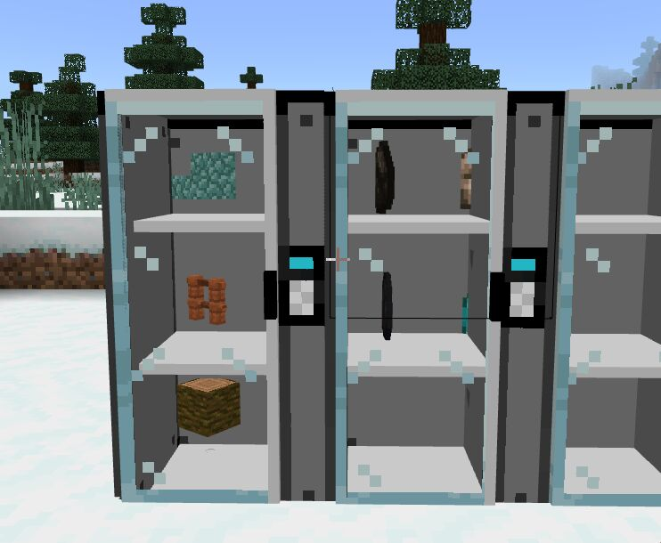
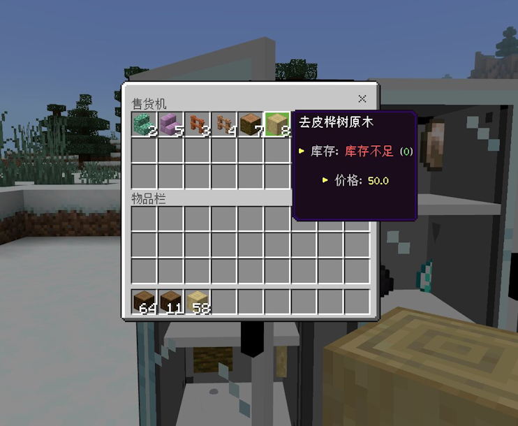
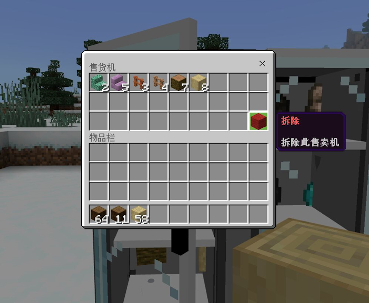
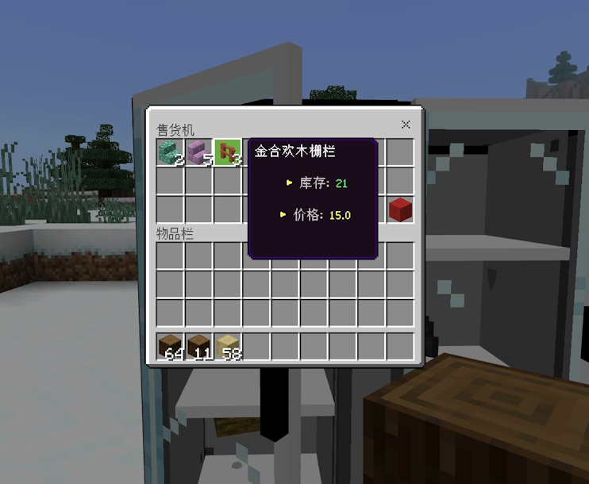

# 
SalesMachine
  

------
 

###⚠️Server

| 核心           | 是否支持 |
|--------------|:----:|
| NukkitX      |  ❌   |
| PowerNukkitX |  ✅   |
| Nukkit-PM1E  |  ✅   |
| Nukkit-MOT   |  ✅   |

### 📝Function
|     |    功能     |
|:---:|:---------:|
|  ✅  | 增加物品以及出售  |
|  ✅  | 是否支持自定义物品 |
|  ✅  |  商品无限库存   |
|  ❌  |   商品回收    |
|  ✅  |  商品数量限购   |
|  ✅  | 刷新商品限购次数  |

### ✋How to use
* 管理员在游戏中执行 `/sa give [玩家] [数量] ` 即可获得售货机物品
将售货机放置即可生成
* 手持物品潜行点击售货机即可添加物品 ⚠首次添加的时候 数量代表出售的数量，之后添加的数量则是增加库存。  

### 👀Display

|    |    |
|----------------------|----------------------|
|    |    |

